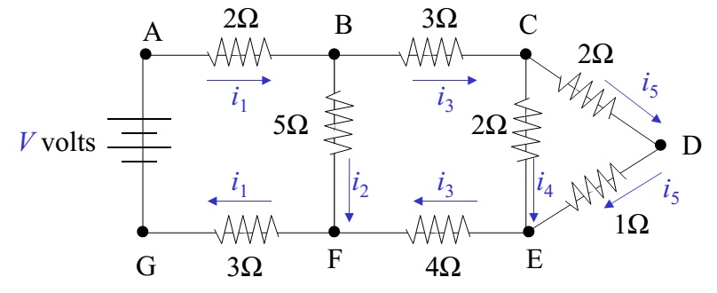

.. resolution_systemes_::

=========================================================
Résolution d'un système d'équations linéaires
=========================================================

.. seance1_:

Séance 1:
==========

.. topic:: Objectif

    En utilisant Matlab, résoudre un système d'équations linéaires par la méthode directe de décomposition **LU**.

1. Etant donné un circuit électrique du la **figure 1**, on souhaite calculer les valeurs efficaces des courantes :math:`i_1`, :math:`i_2`, :math:`\ldots`, :math:`i_5`. En utilisant les lois de `Kirchoff <http://en.wikipedia.org/wiki/Kirchhoff%27s_circuit_laws>`_ , déterminer les équations qui régissent ce circuit électrique.

    Figure 1: Schéma du circuit électrique.

2. Ecrire ces équations sous la forme de :math:`Ax=b`.

voici les équations, si on applique les deux lois de **Kirchoff**.

Neoud :math:`B`.

.. math::

    i_1-i_2-i_3=0

Noeud :math:`C`.

.. math::

    i_3-i_4-i_5=0

Circuit fermé :math:`C_1`:

.. math::

    V-i_1(5\Omega)-i_2(5\Omega)=0

Circuit fermé :math:`C_2`:

.. math::

    -i_3(7\Omega)-i_4(2\Omega)+i_2(5\Omega)=0

Circuit fermé :math:`C_3`:

.. math::

    -i_5(3\Omega)+i_4(2\Omega)=0

et donc le système est donné par:

.. math::

    \begin{pmatrix}
      1 & -1 & -1 & 0 &0 \\
      0 & 0  &  1 & -1 & -1\\
      5 & 5  & 0  & 0  & 0 \\
      0 & 5  & -7 & -2 & 0\\
      0 & 0 &0    & 2 & -3\\
    \end{pmatrix}
    \;\begin{pmatrix}
       i_1\\
       i_2\\
       i_3\\
       i_4\\
       i_5
    \end{pmatrix}=\begin{pmatrix}
       0\\
       0\\
       V\\
       0\\
       0
    \end{pmatrix}

-----

3. Pour :math:`V=10`, résoudre le système :math:`Ax=b` en utilisant l'opérateur **\\** de *Matlab*.

**Script principal**

.. code-block:: matlab

    %fixer la valeur de V
    V=10;

    %matrice A
    A=[1 -1 -1 0 0;
       0  0 1 -1 0;
       5  5 0  0 0;
       0  5 -7 -2 0;
       0  0  0 2 -3];

    %vecteur b
    b=[V;0;0;0;0];

    %résolution par l'opérateur de matlab
    x=A\b

------

4. Ecrire une fonction qui résout un système **triangulaire inférieur**.

.. literalinclude:: ../codes/tp03/rsl_tri_inf.m
    :language: matlab
    :linenos:
    :emphasize-lines: 29

.. note::

    Dans la ligne (29) , la somme :math:`\sum_{j=1}^{i-1} A_{ij}\;x_j` est formulée comme un **produit scalaire**.

-------

5. Ecrire une fonction qui résout un système linéaire **triangulaire supérieur**

.. literalinclude:: ../codes/tp03/rsl_tri_sup.m
    :language: matlab
    :linenos:

-------

6. Ecrire une fonction qui résout un système linéaire :math:`Ax=b` par la méthode de **LU**.

.. centered:: Algorithme LU

:math:`u_{1,1}=a_{1,1}`

**Pour** j=2...n
    :math:`u_{1,j}=a_{1,j}`

    :math:`l_{j,1}=\dfrac{a_{j,1}}{a_{1,1}}`
**fin**

**pour**  i=2..n-1
    :math:`u_{i,i}=a_{i,i}-\sum_{k=1}^{i-1}l_{ik}u_{ki}`

    **Pour** j=1+1..n
        :math:`u_{i,j}=a_{i,j}-\sum_{k=1}^{i-1}l_{ik}u_{kj}`

        :math:`u_{j,i}=\dfrac{1}{u_{i,i}}\big[ a_{j,i}-\sum_{k=1}^{i-1}l_{jk}u_{ki} \big]`
    **fin**
**fin**

.. centered:: fonction decomposition

.. literalinclude:: ../codes/tp03/lu_dcm.m
    :language: matlab
    :linenos:

.. centered:: solve_lu

.. literalinclude:: ../codes/tp03/solve_lu.m
    :language: matlab
    :linenos:

.. centered:: script principal (suite)

.. code-block:: matlab

    %test de la solution avec lu_dcm
    fprintf('solution par la decomposition LU:')
    x1=solve_lu(A,b)
